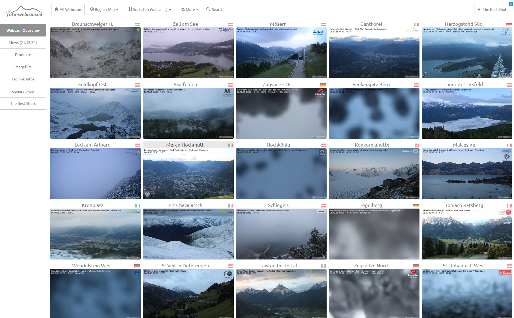

# 🏔️ DDolomitesWpaper

**A lightweight Windows tray app that automatically updates your desktop wallpaper with real-time webcam images from the Dolomites or other regions.**  
**轻量级 Windows 托盘应用，可自动从多洛米蒂山或其他地区的网络摄像头更新桌面壁纸。**

Developed by **Maguamale**  
开发者：**Maguamale**  
📧 Email / 邮箱: [zhengzh@email.com](mailto:zhengzh@email.com)  
🌐 GitHub: [https://github.com/zhengzihao/DDolomitesWpaper](https://github.com/zhengzihao/DDolomitesWpaper)

---

## ✨ Features / 功能特性

### 🖼️ Automatic Wallpaper Update / 自动更新壁纸
Fetches the most recent webcam image every set interval (default: every hour at minute 01, Rome time) and updates your desktop wallpaper automatically.  
程序每隔一定时间自动获取最新的摄像头图像（默认每小时第 01 分，罗马时间），并更新为桌面壁纸。

---

### ⚙️ Customizable Settings / 可自定义设置
- Set your own **webcam base URL** (e.g., from [megacam.at](https://www.megacam.at/) or [foto-webcam.eu](https://www.foto-webcam.eu/))  
  可自定义摄像头地址（如 [megacam.at](https://www.megacam.at/) 或 [foto-webcam.eu](https://www.foto-webcam.eu/)）  
- Choose update interval: **10 min**, **30 min**, **1 hour**, or **custom**  
  可设置刷新间隔：10分钟 / 30分钟 / 1小时 / 自定义  
- Select wallpaper style: **Fill**, **Stretch**, or **Tile**  
  可选择壁纸显示方式：填充、拉伸或平铺  

---

### 🪟 Windows Tray Integration / 托盘集成
Runs quietly in the background with a tray icon.  
程序在后台运行，系统托盘中显示图标。  

Menu options include:  
菜单选项包括：  
- 🏃 Run now / 立即更新  
- 🖼️ Open latest image / 打开最新图片  
- 📁 Open log folder / 打开日志文件夹  
- ⚙️ Settings / 设置  
- ℹ️ About / 关于  
- ❌ Exit / 退出  

---

### 📦 Lightweight & Portable / 轻量便携
Packaged into a single `.exe` file — no installation required.  
程序为单一 `.exe` 文件，无需安装即可运行。

---

## 🌍 Webcam Sources / 摄像头数据源

You can freely select webcam URLs from these two main platforms:  
可以从以下两个主要网站选择摄像头图像源：

| Source / 来源 | Website / 网站 |
|----------------|----------------|
| 🏔️ **Megacam** | [https://www.megacam.at/](https://www.megacam.at/) |
| 📸 **Foto-Webcam** | [https://www.foto-webcam.eu/](https://www.foto-webcam.eu/) |

Below are example overviews from both platforms 👇  
以下是两个网站的示例页面 👇  

**Megacam Example / Megacam 示例：**  


**Foto-Webcam Example / Foto-Webcam 示例：**  


> 💡 Tip / 提示：  
> Click any webcam image on those websites, and copy its base URL (ending with `/webcam/<location>/`).  
> 打开任意摄像头页面，复制其基础网址（以 `/webcam/<地点>/` 结尾）即可。

---

## 🚀 How to Use / 使用方法

1. Run `DDolomitesWpaper.exe`  
   运行 `DDolomitesWpaper.exe`  
2. The app will appear in your Windows system tray  
   程序会在系统托盘中显示图标  
3. Right-click the icon to open the menu  
   右键点击图标打开菜单  
4. Configure webcam URL, update interval, and wallpaper style  
   设置摄像头地址、更新间隔和壁纸样式  
5. The wallpaper will refresh automatically at your set interval 🌄  
   程序将按照设定的时间间隔自动刷新壁纸 🌄  

---

🧱 Build from Source / 源码构建

If you want to rebuild the executable file yourself, use PyInstaller:  
如需自行打包生成 `.exe`，可使用以下命令（基于 PyInstaller）：

```bash
pyinstaller --clean --onefile --noconsole ^
  --name DDolomitesWpaper ^
  --icon DDolomitesWpaper.ico ^
  --hidden-import=pystray --hidden-import=pystray._win32 ^
  --hidden-import=win32api --hidden-import=win32gui --hidden-import=win32con ^
  --collect-submodules=pystray --collect-submodules=PIL ^
  --collect-data tzdata ^
  --add-data "logo.png;." ^
  ddolomites_wpaper.py
